# Theta Coffee Lab ☕

A comprehensive cafe management system with real-time analytics, inventory tracking, and financial reporting.


## Overview

Theta Coffee Lab Management System is a full-stack business intelligence application designed to streamline cafe operations. Built with Python and Streamlit, it provides an intuitive interface for managing sales, inventory, recipes, and financial performance.

## Features

| Feature | Description |
|---------|-------------|
| 📊 **Dashboard** | Real-time KPIs including revenue, orders, gross profit margin, and performance trends |
| 🛒 **Order Management** | Process sales transactions with automatic inventory deduction |
| 📦 **Inventory Control** | Track stock levels with intelligent low-stock alerts based on unit types |
| 🍵 **Recipe Builder** | Create and manage product recipes with automatic COGS calculation |
| 💰 **Financial Analytics** | Comprehensive reports with revenue breakdown, cost analysis, and profitability metrics |
| 🗺️ **Geospatial Analysis** | Visualize customer locations using Google Plus Codes integration |

## Tech Stack

- **Framework**: Streamlit
- **Data Processing**: Pandas, NumPy
- **Visualization**: Plotly (interactive charts)
- **Geolocation**: GeoPy
- **Storage**: CSV-based data persistence

## Architecture

```
┌─────────────────────────────────────────────┐
│           Presentation Layer                │
│         (Streamlit Components)              │
├─────────────────────────────────────────────┤
│           Business Logic Layer              │
│    (Order Processing, COGS Calculation)     │
├─────────────────────────────────────────────┤
│           Data Access Layer                 │
│         (Pandas DataFrames)                 │
├─────────────────────────────────────────────┤
│           Storage Layer                     │
│            (CSV Files)                      │
└─────────────────────────────────────────────┘
```

## Project Structure

```
theta-coffee-lab/
├── app.py                 # Main application entry point
├── utils.py               # Shared utility functions
├── data_init.py           # Data initialization module
├── pages/
│   ├── 1_dashboard.py     # Analytics dashboard
│   ├── 2_order.py         # Order management
│   ├── 3_inventory.py     # Inventory tracking
│   ├── 4_product.py       # Recipe management
│   ├── 5_financial.py     # Financial reports
│   ├── 6_map.py           # Customer location map
│   └── 7_settings.py      # Application settings
└── data/
    ├── sales.csv
    ├── inventory.csv
    ├── products.csv
    ├── product_recipe.csv
    ├── inventory_transactions.csv
    └── operational_costs.csv
```

## Installation

```bash
# Clone the repository
git clone https://github.com/johnha912/theta-coffee-lab.git
cd theta-coffee-lab

# Install dependencies
pip install -r requirements.txt

# Run the application
streamlit run app.py --server.port 5000
```

## Key Technical Highlights

- **Reactive UI**: Leverages Streamlit's reactive paradigm for real-time updates
- **Intelligent Alerting**: Dynamic inventory thresholds based on unit types (ml, g, pcs)
- **Automatic COGS Calculation**: Recipe-based cost computation for accurate profit margins
- **Data Visualization**: Interactive Plotly charts with custom ggplot2-inspired theming
- **Session State Management**: Persistent user preferences across page navigation

## Screenshots

### Home
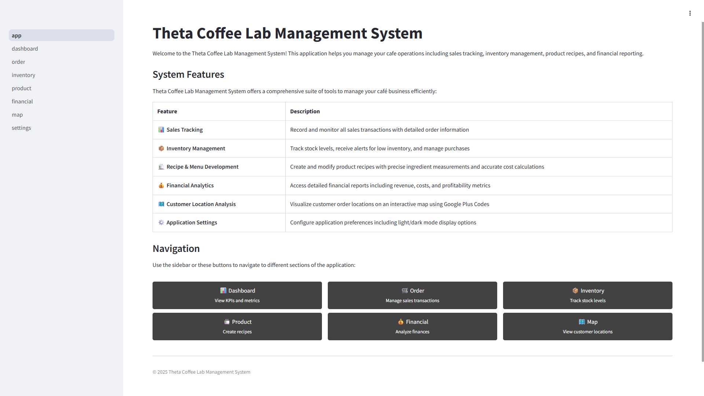

### Dashboard
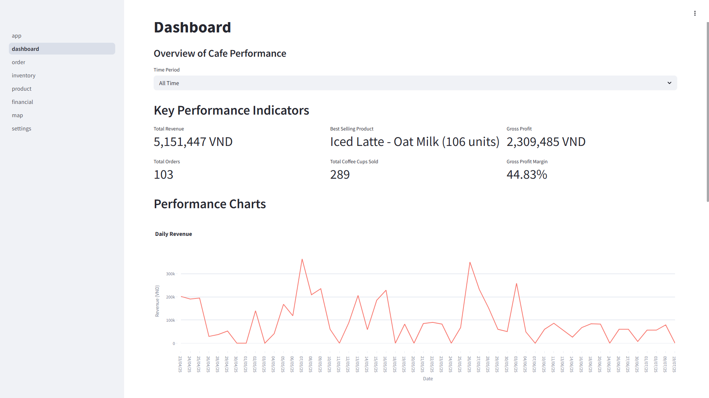
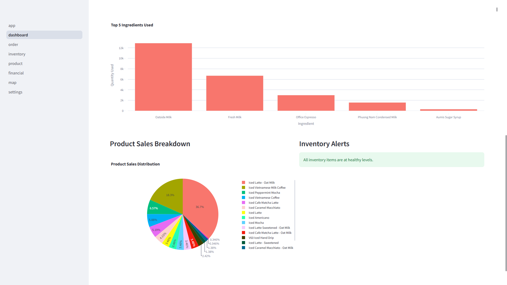

### Order Management
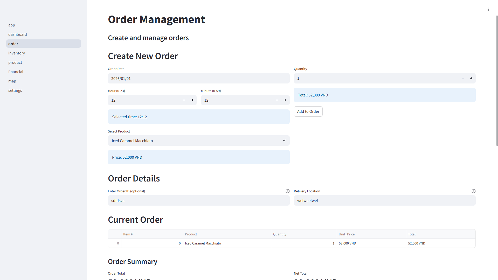


### Inventory
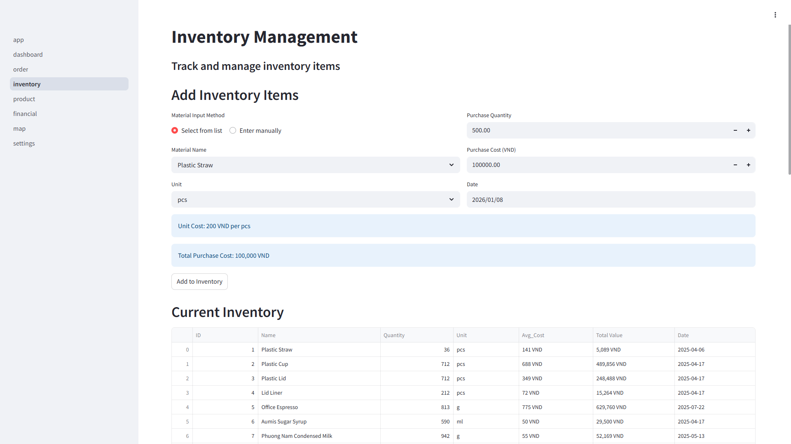
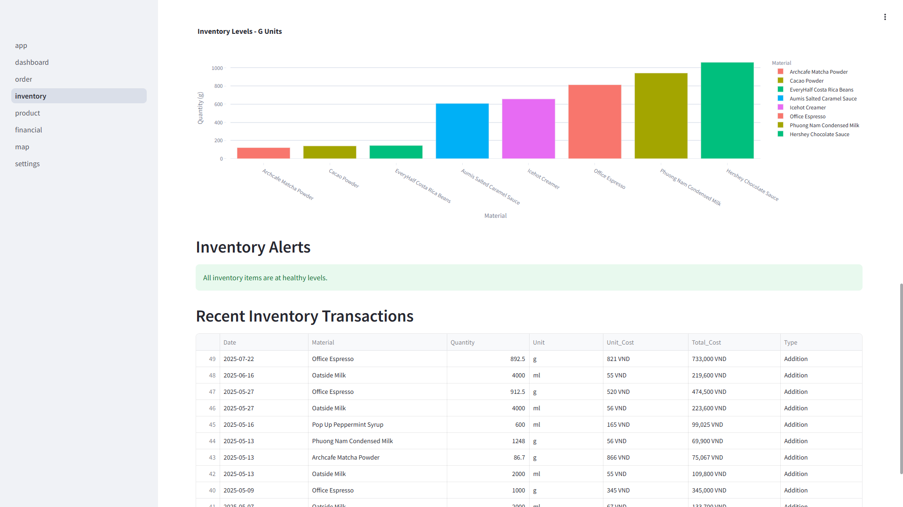

### Product & Recipes

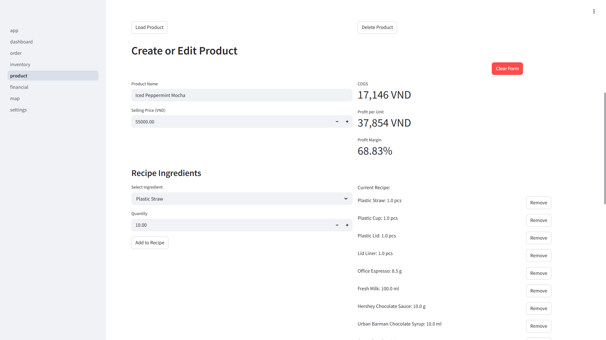
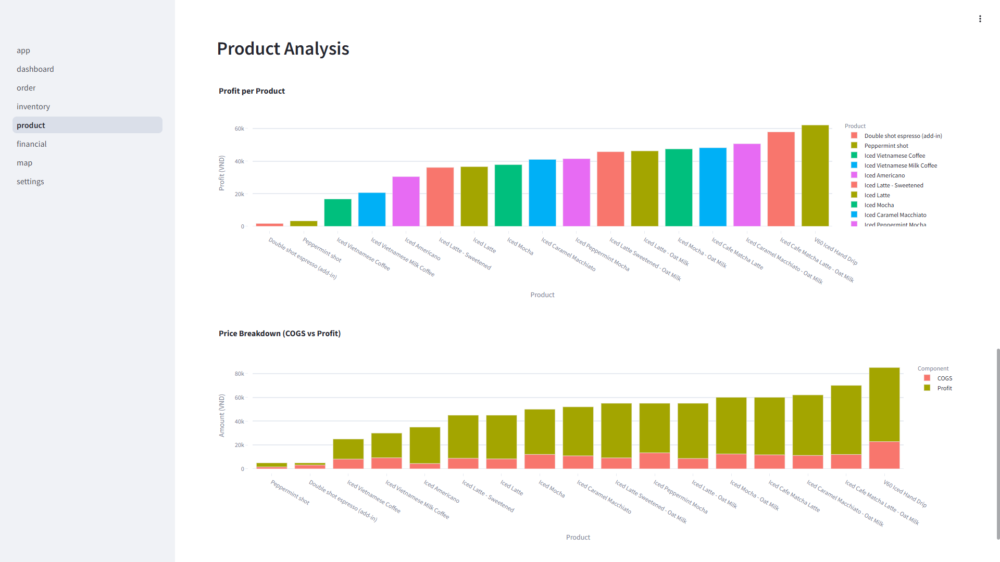

### Financial Reports
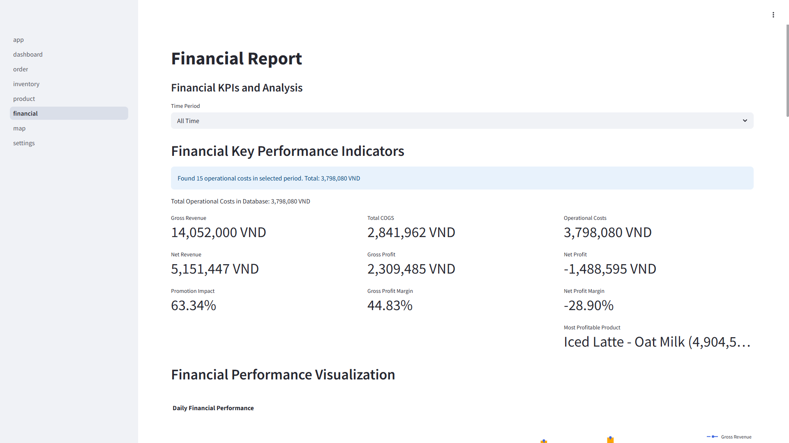
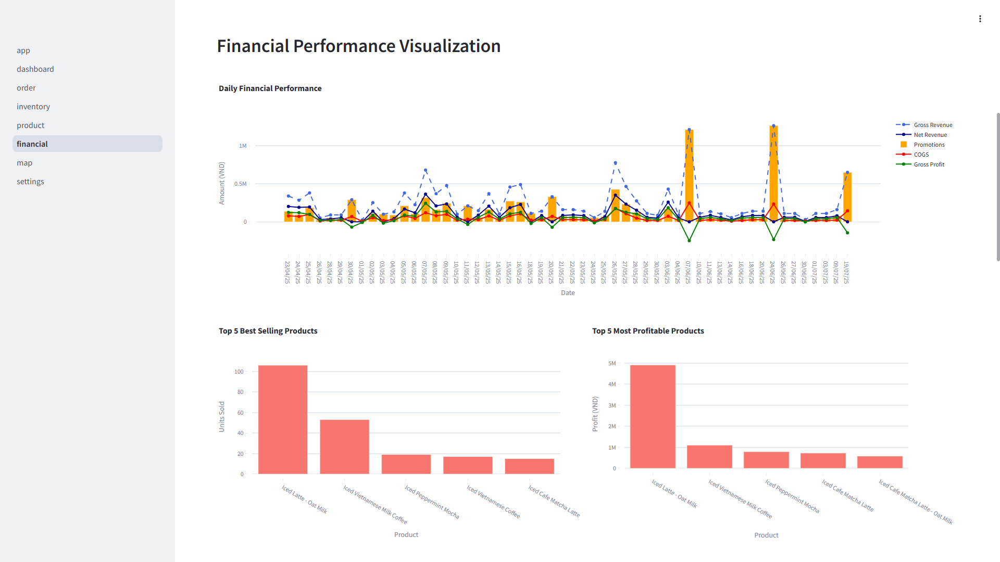
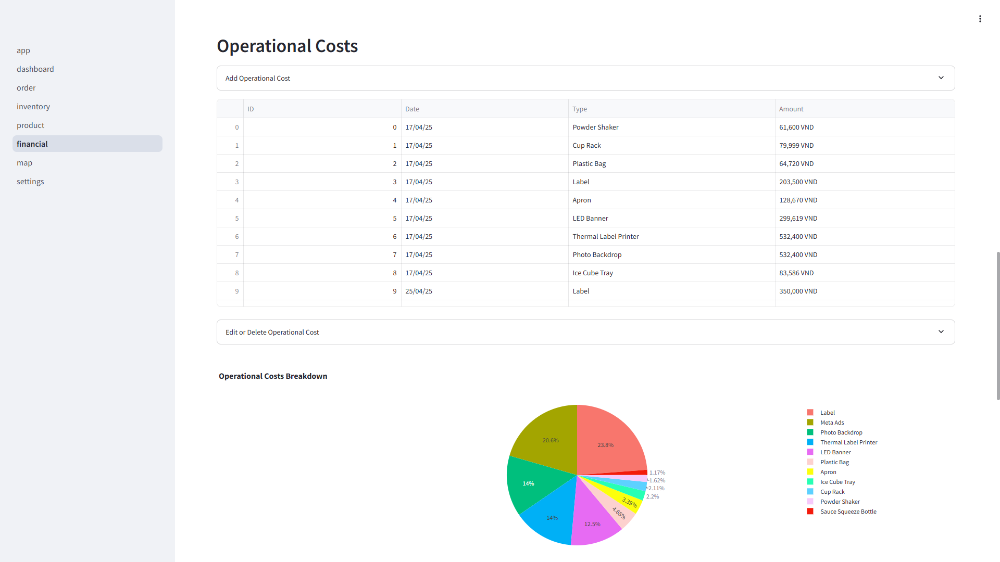
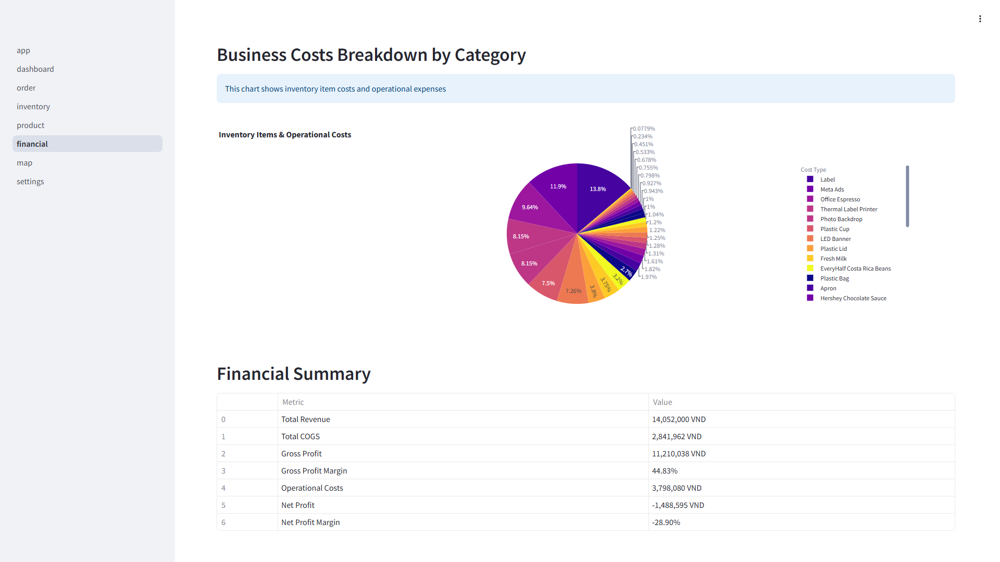

### Customer Map
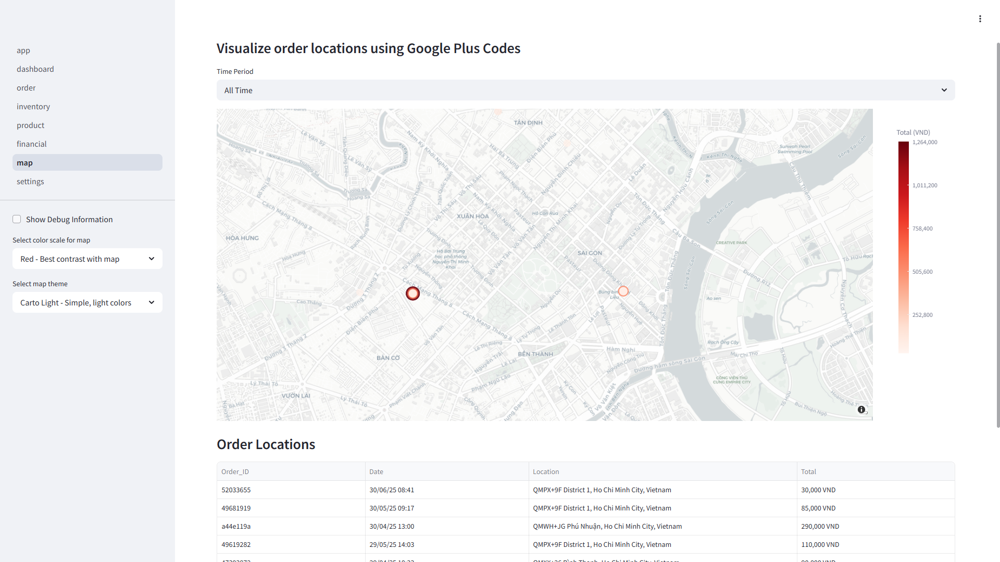
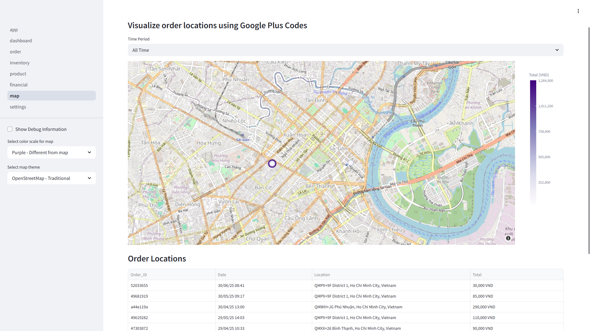

### Settings
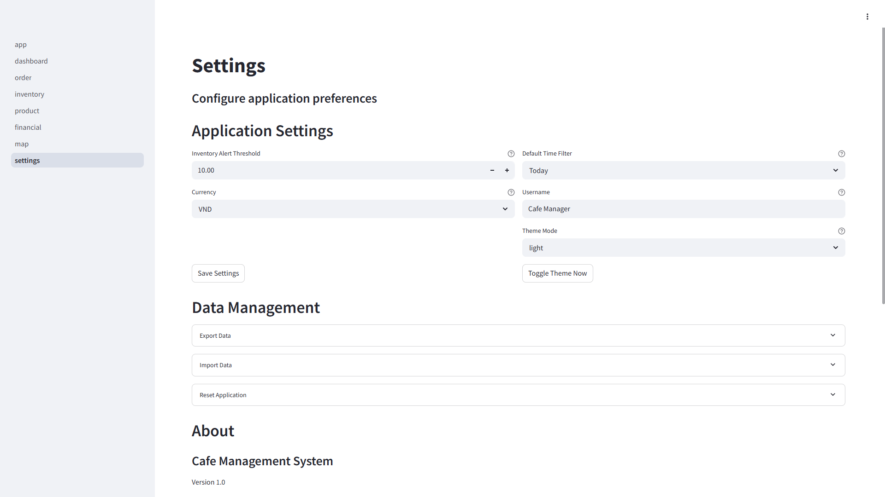
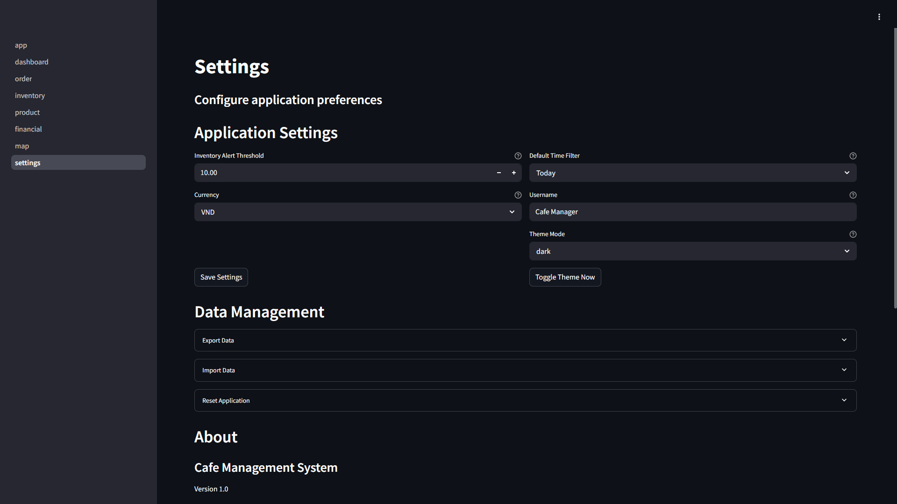

## Future Enhancements

- [ ] PostgreSQL database integration for production scalability
- [ ] User authentication and role-based access control
- [ ] REST API endpoints for mobile app integration
- [ ] Automated report generation and email scheduling

## License

This project is licensed under the MIT License - see the [LICENSE](LICENSE) file for details.

## Author

**Nguyen Ha**

[](https://linkedin.com/in/nguyenha912)
[](https://github.com/johnha912)

---

*Built with ❤️ using Python and Streamlit*
